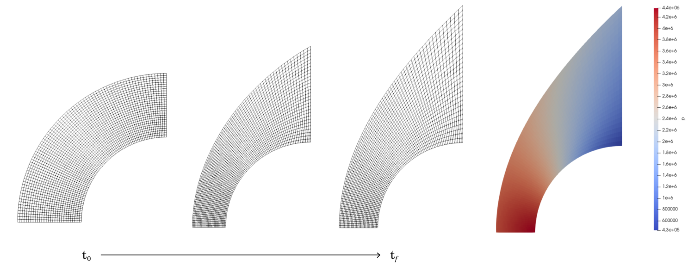

# A Guide to Compressible Flow CFD with Eilmer4
Download the Guide [here](cfdguide.pdf)

### Author
T. J. Herik - XLabs Research Assistant, Mechanical Engineer, Aerospace Engineer, Mathematician.

### The Guide
This guide was produced to provide a CFD walkthrough for beginner PhD, MPhil, etc. students completing experimental hyperonics research in the University of Queenslands, XLabs super-orbital expansion tube laboratory. The guide offers a revision of key theory as well as tutorials to produce Hyperonsic CFD from the ground up in Eilmer4.

 Contents (click to open) 

Gas models, high-temperature gas effects, chemistry models, energy transfer, installation and setup of Ubuntu and Eilmer4, paraview setup, examples of constructing fundamental hypersonic geometries in Eilmer4 (wedges, cones, double wings, cylinders, data-point-based geometries, parametric models), simulating high-temperature gas effects in Eilmer4 (finite-rate chemistry, two-temperature models for thermochemical non-equilibrium)

 Future additions (click to open) 

 
Implicit vs. explicit solvers, grid independence studies, using the Eilmer4 Newton-Krylov steady-state solver, viscous simulations, catalysis, y+ studies, turbulence.
 

### Eilmer4
Eilmer4 (a compressible flow CFD tool) is one of multiple programs which can be found in the gas dynamics tool kit ([gdtk](https://gdtk.uqcloud.net/)) maintained by the University of Queensland. Please note, Eilmer4 has additional guides and further examples and verification on their website.
